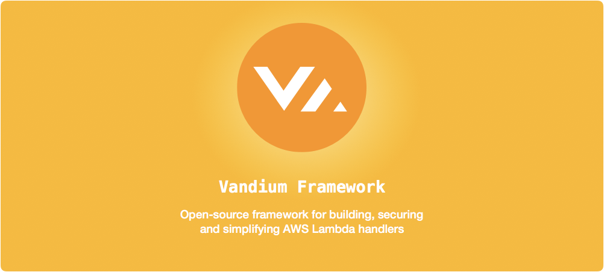

[AWS Lambda](https://aws.amazon.com/lambda/details) framework for building functions using [Node.js](https://nodejs.org) for
[API Gateway](https://aws.amazon.com/api-gateway), IoT applications, and other AWS events.

# Features
* Simplifies writing lambda handlers
* Automatically verifies event types
* Powerful input validation
* Works with [Serverless](https://serverless.com/)
* JSON Web Token (JWT) verification and validation
* Automatic loading of environment variables from SSM Parameter Store
* Cross Site Request Forgery (XSRF) detection when using JWT
* SQL Injection (SQLi) detection and protection
* Lambda Proxy Resource support for AWS API Gateway
* Handler initialization for allocating resources
* Post handler execution to allow deallocation of resources
* Forces values into correct types
* Handles uncaught exceptions
* Promise support
* Automatically trimmed strings for input event data
* Low startup overhead
* AWS Lambda Node.js 6.10.x compatible

# Installation

Install via npm

	npm install vandium --save

# Getting Started

Vandium creates event specific handlers to reduce the amount of code than one needs to maintain.

```js
const vandium = require( 'vandium' );

// handler for an api gateway event
exports.handler = vandium.api()
		.GET( (event) => {

			// return greeting
			return 'Hello ' + event.pathParmeters.name + '!';
		});
```

# Event Types

Vandium targets specific event types to allow validation and targeting of specific event specific data. The following event types are
supported by the framework:

- [api](apigateway.md)
- [cloudformation](cloudformation.md)
- [cloudwatch](cloudwatch.md)
- [cognito](cognito.md)
- [dynamodb](dynamodb.md)
- [generic](generic.md)
- [kinesis](kinesis.md)
- [lex](lex.md)
- [s3](s3.md)
- [scheduled](scheduled.md)
- [ses](ses.md)
- [sns](sns.md)

**Note:** The `generic` handler for custom or generic handling of any of the event types if further control or customization is required.


# Initializing before event handler is called

Vandium provides the opportunity for initialization code to be executed on each invocation of your handler. The `before()` method is used to
define code that gets called before the handler to do things like open a database connection or connect with a cache instance.

The following example demonstrates how you can use the `before()` method to open a cache before the handler is called:

```js
const vandium = require( 'vandium' );

const User = require( './user' );

const cache = require( './cache' );

exports.handler = vandium.api()
        .before( (context) => {

            return cache.connect();
        })
        .GET( (event, context) => {

                // handle get request
                return User.get( event.pathParmeters.name );
            })
        .POST( {

                // validate
                body: {

                    name: vandium.types.string().min(4).max(200).required()
                }
            },
            (event) => {

                // handle POST request
                return User.create( event.body.name );
            });
```

The code inside the `before()` method can be:
* Synchronous
* Asynchronous (in the form of `(context, callback)=> {}`)
* Promise

And any result returned will be stored in `context.additional` and can be accessed in the handler and `finally()` methods.

**Note:** If an exception is thrown in the `before()` method, then the `finally()` method will not be called.

# Cleaning up after event handlers

You can clean up and free resources using the `finally()` method on all event handlers. The `finally()` method is executed after each
execution of the handler if your code has been executed. If an exception is raised within the `finally()` function, it will get logged and
execution will continue.

The following example shows how you can use the `finally()` method to free a cache connection after each execution using the `api` event
type:

```js
const vandium = require( 'vandium' );

const User = require( './user' );

const cache = require( './cache' );

exports.handler = vandium.api()
        .before( (context) => {

            return cache.connect();
        })
        .GET( (event) => {

                // handle get request
                return User.get( event.pathParmeters.name );
            })
        .POST( {

                // validate
                body: {

                    name: vandium.types.string().min(4).max(200).required()
                }
            },
            (event) => {

                // handle POST request
                return User.create( event.body.name );
            })
        .finally( () => {

            // close the cache if open - gets executed on every call
            return cache.close();
        });
```

**Note:** If an exception is thrown during the validation and verification, such as JWT processing, phase prior to your code
execution, then the code inside `finally()` will not get called.

# Configuration via `vandium.json`

If you would like to specify configuration using a configuration file, you can place a `vandium.json` file at the root of your project. The
file is a standard JSON file with the following structure:

```js
{
    "jwt": {

        "algorithm": "<algorithm-type>",
        "publicKey": "<public key>",        // if using RS256
        "secret": "<secret value>",         // if using HS256, HS384 or HS512
        "token": "<token path inside event>",
        "xsrf": "true | false",
        "xsrfToken": "<xsrf token path inside element>",
        "xsrfClaim": "<xsrf claim path inside jwt element>"
    },
    "prevent": {

        "eval": "true | false"              // prevents the use of eval()
    }
}
```

# Automatic Loading of Environment Variables from SSM Parameter Store

Vandium can automatically load environment variable values from the [AWS SSM Parameter Store](http://docs.aws.amazon.com/systems-manager/latest/userguide/systems-manager-paramstore.html). The environment variables are
loaded synchronously and thus will be set before any other code is loaded. To provide the SSM path where the environment variables
are located, set the `VANDIUM_PARAM_STORE_PATH` environment variable at deployment time. We recommend using a path-based approach to
storing environment variables using the following convention:

    /<group name>/<stage>/env

where the `<group name>` might be the name of the service or function name, and the `<stage>` would represent "production", "test", etc.

The format is user defined by the path and all values underneath the path will be loaded from SSM.

**Note:*** Please ensure that your Lambda function has the correct permissions to access the SSM Parameter Store including access to
custom KMS keys (if used to encrypt secrets).

# Support for Node 4.3.2
If you require support for the previous version of Node.js (4.x) then use Vandium 3.x

# Compatibility Issues with Vandium 3 Projects

Vandium 4's event handler mechanism allows targeted handling of event specific scenarios and thus code written using Vandium 3.x will
**not** be compatible with this version. To migrate your Vandium 3 code, use a targeted event handler or the
[`generic`](docs/events/generic.md) event.


# Feedback

We'd love to get feedback on how to make this tool better. Feel free to contact us at `feedback@vandium.io`


# License

[BSD-3-Clause](https://en.wikipedia.org/wiki/BSD_licenses)
